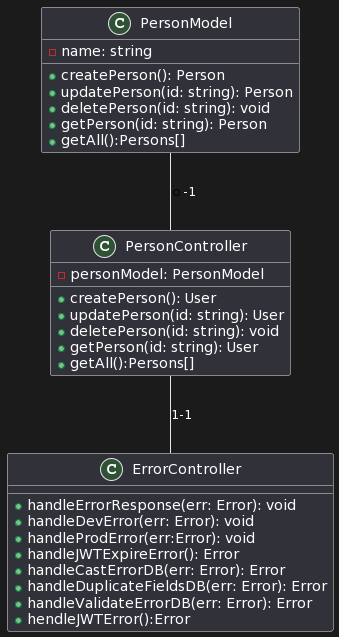

# HNGx Task Two

This is a READme or Guide through my project which is a simple REST API that can perform basic CRUDE OPERATIONS. HNGx task 2

## Table of Contents

- [Prerequisites](#prerequisites)
- [Installation](#installation)
- [Navigation](#navigation)
- [Installing Dependecies](#installing-dependencies)
- [Running the Application](#running-the-application)
- [Project Structure](#project-structure)
- [Link to API](#link-to-api)
- [Project UML]()


## Prerequisites

Before you begin, ensure you have met the following requirements:

- Node.js and npm installed on your development machine.
- Basic knowledge of TypeScript and Express.js.

### Installation

1. Clone this repository:
   ```bash
   git clone https://github.com/AirZED/HNGX.git
### Navigation
2. Navigate to the project directory:
    ```bash
        cd HNGX
        cd task-two
### Installing Dependencies
3. Install application dependencies
    ```bash 
        npm install
### Running the Application
4. Run the application using the following commands
    ```bash
        tsc -w /* to enter watch mood */
        npm run start:dev 

### Project Structure
5. Project is neatly structured as shown below
- **`src/`**: This directory contains the source code of the application.
  - **`controllers/`**: Controllers for handling HTTP requests and business logic.
  - **`utils/`**: Custom functions for request processing.
  - **`models/`**: Data models or database schemas.
  - **`routes/`**: Express route definitions, organized by feature or resource.
  - **`app.ts`**: The entry point of the application that sets up the Express app.
  - **`db.ts`**: Hold the Database connection logic.
  - **`server.ts`**: Configures and starts the Express server.

### Link to API
 ```bash
    https://hngx-two.onrender.com
 ```

### Project UML Diagram
#### User UML
